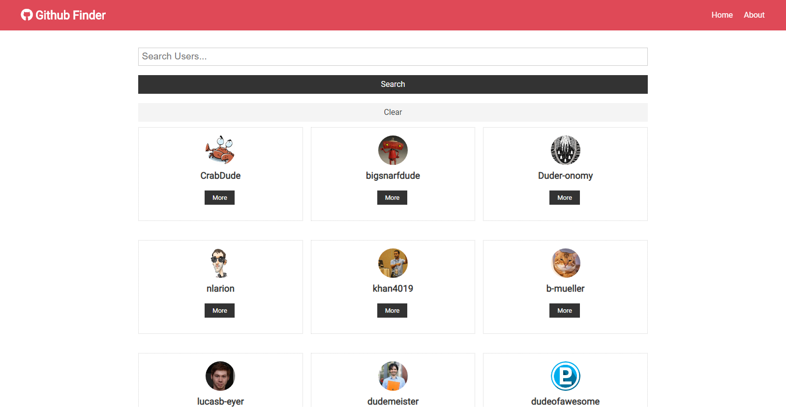
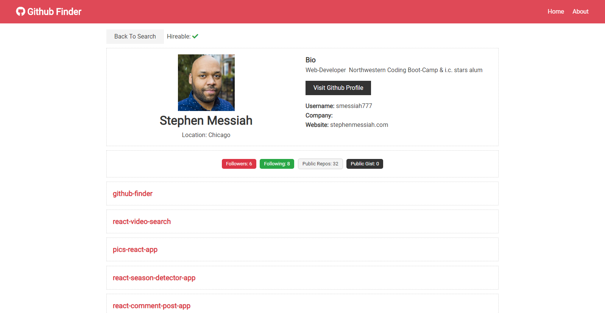

  

<h1 align="center">Github Profile Finder </h1>

<h2 align="center">  A React App</h2>

## Overview

React app that allows user to search for Github profiles using the Github API

This app was created with React Context API and Hooks

## Features

- User able to search for Github profiles using a search bar
- User can click on the more button to see relevant profile information
- App displays Github profile avatar and username
- App displays Github user's location
- App displays if Github profile user is hireable
- App displays Github profile Bio
- App displays Github profile user's github link
- App displays Github profile user's company and website link
- App displays Github profile user's number of followers
- App displays how many profiles user is following on github
- App displays Github profile users number of public repos and public gists
- App displays Github profile users 5 latest repos

## Core Technologies

- React
- React Router
- Github API

## Deployment Link

<a href="https://github-profile-search-app.netlify.com/" target="_blank">Github Profile Finder</a>
